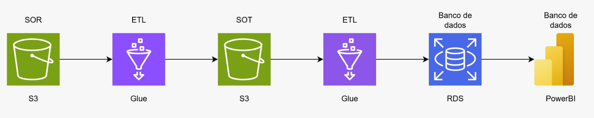

# TechChallenge3 • Pipeline de Dados (AWS + Power BI)

> **Objetivo**  
> Construir uma pipeline de dados que parte de uma camada **SOR** (Source of Records) no Amazon **S3**, aplicar transformações com **AWS Glue**, carregar dados harmonizados na **SOT** (Source of Truth) também no S3, carregar os dados tratados da SOT em um **RDS** (banco relacional) através do **AWS Glue** e disponibilizaz para análise no **Power BI**.

---

## Arquitetura:

Fluxo (da esquerda para a direita):

1. **SOR (S3)** – dados brutos (CSV).  
2. **Glue – ETL** – limpeza, padronização, *de/para*, *dedup*, enriquecimentos.  
3. **SOT (S3)** – dados prontos para consumo analítico/ingestão.  
4. **Glue – Ingestão** – *upsert* no banco relacional (RDS) via JDBC.  
5. **RDS** – modelo relacional para BI (tabelas fato/dim).  
6. **Power BI** – relatórios/dashboards conectados ao RDS.

---

## Stack

- **AWS S3** (data lake – zonas `sor/` e `sot/`)  
- **AWS Glue** (Jobs de ETL em PySpark + Crawlers + Data Catalog)  
- **AWS RDS** (PostgreSQL)  
- **Power BI**  
- **Python 3.10+**

### Estrutura do Repositório

- `docs/pipeline_dados.png` — diagrama da solução  
- `docs/Depara.xlsx` — mapeamentos (*de/para*) usados no ETL  
- `src/glue_jobs/glue_sor_to_sot.py` — Job Glue 1  
- `src/glue_jobs/glue_sot_to_rds.py` — Job Glue 2  
- `src/sql/rds_ddl.sql` — DDL para criar o esquema no RDS  

---
## De/Para (Mapeamento PNAD → SOT)

O arquivo [`docs/Depara.xlsx`](docs/Depara.xlsx) contém o mapeamento das colunas originais da PNAD para os nomes padronizados da camada **SOT**.  
Esse mapeamento é aplicado no **ETL (Glue)** para garantir consistência semântica e padronização de atributos.

| Variável Final (SOT) | Coluna Original PNAD | Descrição / Observação |
|-----------------------|----------------------|-------------------------|
| ano                   | partição (caminho)  | Ano extraído do path `.../ano=2020/` |
| mes                   | partição (caminho)  | Mês extraído do path `.../mes=07/` |
| uf_sigla              | UF                  | Código da UF mapeado para sigla (ex.: `26 → PE`) |
| situacao_domicilio    | V1022               | Situação do domicílio: `1=Urbano`, `2=Rural` |
| sexo                  | A003                | Sexo: `1=Masculino`, `2=Feminino` |
| escolaridade          | A005                | Nível de instrução mais elevado alcançado |
| faixa_idade           | A002                | Idade agrupada em faixas (0-14, 15-24, etc.) |
| febre                 | B001                | Teve febre nos últimos 14 dias (`1=Sim`, `2=Não`) |
| tosse                 | B002                | Teve tosse nos últimos 14 dias |
| dificuldade_respirar  | B003                | Relatou dificuldade de respirar |
| perda_olfato_paladar  | B004                | Relatou perda de olfato ou paladar |
| fadiga                | B005                | Teve fadiga |
| procurou_atendimento  | B006                | Procurou atendimento médico (`1=Sim`, `2=Não`) |
| atendimento_sus_hospital | B007             | Atendimento em hospital público (SUS) |
| atendimento_priv_hospital | B008           | Atendimento em hospital privado |
| internacao            | B009                | Houve internação hospitalar |
| sedado_entubado       | B010                | Precisou ser sedado/entubado |
| auxilio_emergencial   | C001                | Recebeu auxílio emergencial (`1=Sim`, `2=Não`) |
| seguro_desemprego     | C002                | Recebeu seguro desemprego |
| bolsa_familia         | C003                | Recebeu bolsa família |

> 🔎 Esse **De/Para** é essencial para normalizar os dados antes de carregar no **SOT** e posteriormente no **RDS**, permitindo análises consistentes no Power BI.